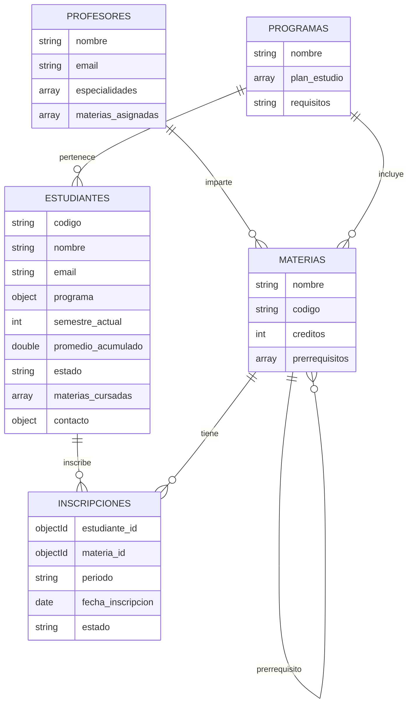

# Sistema de Gestión Académica - MongoDB
## Andres Mauricio Quintero Rios
## Contexto
Una universidad necesita modernizar su sistema académico usando una base de datos NoSQL (MongoDB) para mayor flexibilidad y escalabilidad. El sistema debe manejar:
- Estudiantes: Información personal, historial académico, materias cursadas y calificaciones
- Profesores: Datos personales, especialidades, materias que imparten y horarios
- Materias: Información de cursos, prerrequisitos, créditos y contenidos
- Programas Académicos: Carreras, planes de estudio y requisitos de graduación
- Inscripciones: Registro de estudiantes en materias por período
- Calificaciones: Notas, evaluaciones y seguimiento académico

**¿Por qué MongoDB?**
- Permite manejar datos variables y complejos.
- Consultas rápidas sobre documentos completos.
- Escalabilidad y flexibilidad para el sistema académico.

---

## Puntos a Entregar

### 1. Creación de Colecciones y Esquemas
- Colecciones requeridas: estudiantes, profesores, materias, programas, inscripciones.
- Validaciones de esquema usando `$jsonSchema` para garantizar integridad.
- Relaciones: referencias (ObjectId) y documentos embebidos según el caso.

### 2. Inserción de Datos
- Mínimo 20 documentos por colección.
- Datos realistas y coherentes.
- Relaciones consistentes entre colecciones.
- Variedad en los datos y casos especiales.

### 3. Validaciones de Esquema y Restricciones
- Validación de email institucional.
- Rango válido de calificaciones (0.0 - 5.0).
- Rango válido de semestres (1 - 12).
- Estados válidos para estudiantes.
- Créditos mínimos y máximos por materia.
- Validación de fechas.
- Justificación de cada validación implementada.

### 4. Funciones CRUD Documentadas
- Scripts para Create, Read, Update, Delete en cada colección.
- Ejemplo de función para inscribir estudiante en materia.

### 5. Transacciones y Validación de Información
- Implementar transacciones en operaciones críticas:
  - Inscripción en múltiples materias
  - Registro de calificaciones y actualización de promedio
  - Retiro de materia y actualización de créditos
  - Graduación de estudiante
- Uso de transacciones multi-documento para garantizar atomicidad.

### 6. Funciones de Agregación y Reportes
- Funciones de agregación para reportes académicos:
  - Promedio de calificaciones por materia
  - Estudiantes en riesgo académico
  - Materias más reprobadas
  - Carga académica de profesores
  - Estadísticas de graduación
  - Ranking de estudiantes
  - Análisis de deserción

### 7. Change Streams (Triggers)
- Implementar cinco Change Streams para lógica de negocio:
  - Auditoría de cambios en estudiantes
  - Notificación de riesgo académico
  - Actualización automática de créditos
  - Validación de cupos en materias
  - Historial académico de calificaciones

---

## Ejemplo de Comandos y Funciones

### Creación de Colección con Validación
```js
// Ejemplo para estudiantes
 db.createCollection("estudiantes", {
   validator: {
     $jsonSchema: {
       bsonType: "object",
       required: ["codigo", "nombre", "email", "programa"],
       properties: {
         codigo: { bsonType: "string" },
         nombre: { bsonType: "string" },
         email: {
           bsonType: "string",
           pattern: "^[a-zA-Z0-9._%+-]+@[a-zA-Z0-9.-]+\\.[a-zA-Z]{2,}$"
         },
         programa: {
           bsonType: "object",
           required: ["id", "nombre"],
           properties: {
             id: { bsonType: "objectId" },
             nombre: { bsonType: "string" }
           }
         },
         semestre_actual: { bsonType: "int", minimum: 1, maximum: 12 },
         promedio_acumulado: { bsonType: "double", minimum: 0.0, maximum: 5.0 }
       }
     }
   }
 });
```

### Inserción de Datos
```js
 db.estudiantes.insertMany([
   {
     codigo: "EST001",
     nombre: "María Fernanda López García",
     email: "maria.lopez@universidad.edu.co",
     fecha_nacimiento: ISODate("2003-05-15"),
     programa: {
       id: ObjectId("..."),
       nombre: "Ingeniería de Software",
       codigo: "ISOFT"
     },
     semestre_actual: 5,
     promedio_acumulado: 4.2,
     creditos_cursados: 85,
     estado: "Activo",
     materias_cursadas: [
       {
         materia_id: ObjectId("..."),
         codigo: "BD101",
         nombre: "Bases de Datos I",
         periodo: "2024-1",
         nota_final: 4.5,
         creditos: 4
       }
     ],
     contacto: {
       telefono: "+57 300 123 4567",
       direccion: "Calle 45 #23-10, Medellín",
       ciudad: "Medellín"
     }
   }
   // ... 19 estudiantes más
 ]);
```

### Función CRUD Ejemplo
```js
function inscribirEstudiante(codigoEstudiante, codigoMateria, periodo) {
  const estudiante = db.estudiantes.findOne({ codigo: codigoEstudiante });
  if (!estudiante) return { error: "Estudiante no encontrado" };
  const materia = db.materias.findOne({ codigo: codigoMateria });
  if (!materia) return { error: "Materia no encontrada" };
  db.inscripciones.insertOne({
    estudiante_id: estudiante._id,
    materia_id: materia._id,
    periodo: periodo,
    fecha_inscripcion: new Date(),
    estado: "Inscrito"
  });
  return { success: true, mensaje: "Inscripción realizada exitosamente" };
}
```

### Ejemplo de Change Stream (Trigger)
```js
const changeStreamEstudiantes = db.estudiantes.watch();
changeStreamEstudiantes.on("change", function(change) {
  db.auditoria.insertOne({
    fecha: new Date(),
    operacion: change.operationType,
    coleccion: "estudiantes",
    documento_id: change.documentKey._id,
    cambios: change.updateDescription || {},
    usuario: "sistema"
  });
  print("Auditoría registrada: " + change.operationType);
});
```

---

## Diagrama Entidad-Relación (ER) - Sistema Académico



---

## Recomendaciones para el Administrador
- Realizar copias de seguridad periódicas.
- Restaurar la base de datos cuando sea necesario.
- Optimizar consultas usando índices.
- Mantener y actualizar validaciones de esquema.
- Monitorear triggers y auditoría de cambios.

---

## ¿Dudas o problemas?
Si tienes alguna pregunta sobre cómo ejecutar los comandos, crear colecciones o insertar datos, ¡pide ayuda!
